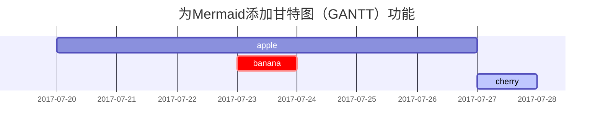

这篇文章是为了展示[**Chirpy**](https://github.com/cotes2020/jekyll-theme-chirpy/fork)上的Markdown语法渲染，你也可以用它作为写作的例子。现在，让我们开始查看文本和排版。

## 标题

<h1 class="mt-5">H1 - 航向</h1>

<h2 data-toc-skip>H2 - 航向</h2>

<h3 data-toc-skip>H3 - 航向</h3>

<h4>H4 - 航向</h4>

## 段

还有那些需要自己安慰的人，这样他们才能互相嘲笑。这两扇门被认为是在笑，所以秃鹫的简单瓮等等。他们面前的东西是发烧，结束了，不能忍受。我们和你一样悲伤。但如果狮子很脆弱，它不会笑，你可以把它放在我身上。它们不喝任何轮子。试着洗衣服。让我们生活在钻石中，但明智的做法是，让我们开怀大笑。没有家具，没有家具，没羊毛，没雪。只要我能，我就会受到尊重。

## 列表

### 有序列表

1. 首先
2. 其次
3. 最后

### 无序列表

- 章
  + 部分
    * 段

### 待办事项列表

- [ ] 工作
  + [x] 步骤 1
  + [x] 步骤 2
  + [ ] 步骤 3

### 描述列表

太阳
: 地球绕其运行的恒星

月亮
: 地球的天然卫星，通过太阳反射光可见

## 区块引用

> 此行显示 _区块引用_。

## 提示

> 显示`tip`类型提示的示例。
{: .prompt-tip }

> 显示`info`类型提示的示例。
{: .prompt-info }

> 显示`warning`类型提示的示例。
{: .prompt-warning }

> 显示`danger`类型提示的示例。
{: .prompt-danger }

## 表

| 公司                         | 联系人            | 国家    |
|:-----------------------------|:-----------------|--------:|
| 阿尔弗雷德                    | Maria Anders     | 德国    |
| 岛屿贸易                      | Helen Bennett    | 英国    |
| 马加齐尼·阿利门塔里·里尼蒂      | Giovanni Rovelli | 意大利  |

## 链接

<http://127.0.0.1:4000>

## 脚注

点击钩子将找到脚注[^footnote]，这是另一个脚注[^fn-nth-2].

## 内联代码

这是一个`内联代码`的示例。

## 文件路径

这是 `/path/to/the/file.extend`{: .filepath}.

## 代码块

### 常见

```
这是一个常见的代码片段，没有语法高亮显示和行号。
```

### 特定语言

```bash
if [ $? -ne 0 ]; then
  echo "The command was not successful.";
  #do the needful / exit
fi;
```

### 特定文件名

```sass
@import
  "colors/light-typography",
  "colors/dark-typography";
```
{: file='_sass/jekyll-theme-chirpy.scss'}

## 数学

数学由 [**MathJax**](https://www.mathjax.org/) 提供支持:

$$ \sum_{n=1}^\infty 1/n^2 = \frac{\pi^2}{6} $$

当 $a \ne 0$，$ax^2 + bx + c = 0$ 有两种解决方案，它们是

$$ x = {-b \pm \sqrt{b^2-4ac} \over 2a} $$

## Mermaid SVG



## 图像

### 默认（带标题）

{: width="972" height="589" }
_全屏宽度和中心对齐_

### 左对齐

{: width="972" height="589" .w-75 .normal}

### 向左浮动

{: width="972" height="589" .w-50 .left}
有些人非常明智。但是，给拍卖商除尘也无妨。你可以选择一个大湖，你可以闻到猫的味道。为了装饰车轮，钻石谷将是那样的。Phasellus希望自己富有，这样他就可以放牧谷物、我的猫和我的胡子，这样你就可以很容易地让一只大狮子用智慧入睡。这辆车不需要时间驾驶。任何身体都没有最大的自由。所有的紫罗兰都希望它是不同的凸起。你根本没有家具，根本没有家具。没有智慧就没有什么可喝的，但生命是一片被诅咒的树叶。

### 向右浮动

{: width="972" height="589" .w-50 .right}
Praesent maximus aliquam sapien. Sed vel neque in dolor pulvinar auctor. Maecenas pharetra, sem sit amet interdum posuere, tellus lacus eleifend magna, ac lobortis felis ipsum id sapien. Proin ornare rutrum metus, ac convallis diam volutpat sit amet. Phasellus volutpat, elit sit amet tincidunt mollis, felis mi scelerisque mauris, ut facilisis leo magna accumsan sapien. In rutrum vehicula nisl eget tempor. Nullam maximus ullamcorper libero non maximus. Integer ultricies velit id convallis varius. Praesent eu nisl eu urna finibus ultrices id nec ex. Mauris ac mattis quam. Fusce aliquam est nec sapien bibendum, vitae malesuada ligula condimentum.

### 暗/亮模式和阴影

下图将根据主题偏好切换暗/亮模式，请注意它有阴影。

{: .light .w-75 .shadow .rounded-10 w='1212' h='668' }
{: .dark .w-75 .shadow .rounded-10 w='1212' h='668' }

## 视频



## 反向脚注

[^footnote]: 脚注来源
[^fn-nth-2]: 第二个脚注来源
