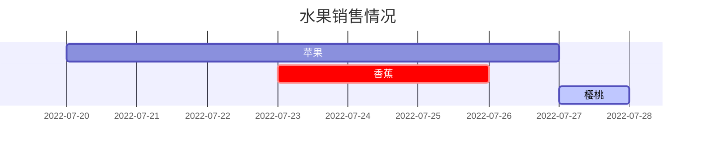
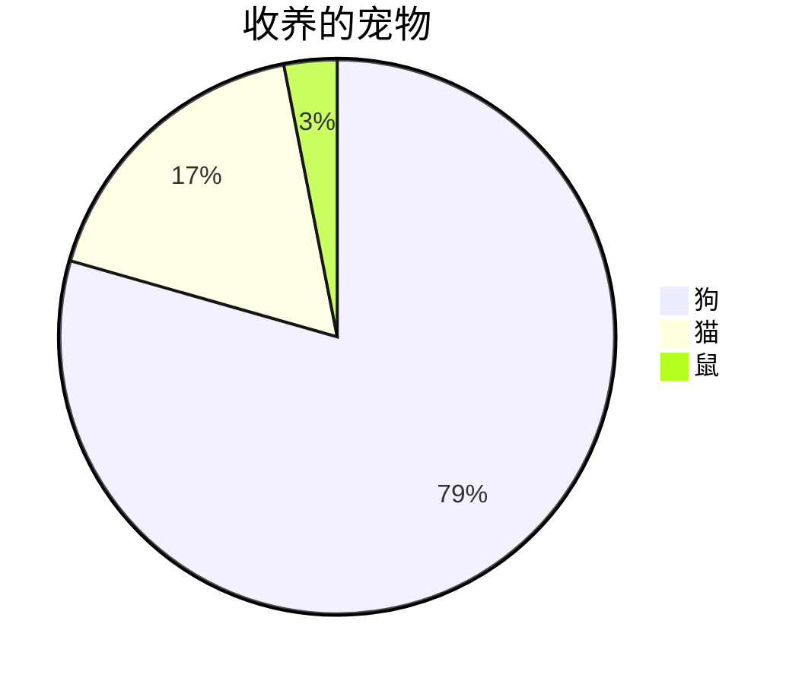

这篇文章是为了展示帖子的Markdown语法渲染，你也可以用它作为写作的例子。现在，让我们开始查看文本和排版。

## 标题

通过`#`创建标题，当有7个`#`时与普通文本无异，即最多6级标题，需要在最后一个`#`后空一格书写标题。

```markdown
# 1级标题
## 2级标题
### 3级标题
#### 4级标题
```

_将呈现为：_

# 1级标题
## 2级标题
### 3级标题
#### 4级标题

## 段落

段落将无视行首空格`Space`或制表符`Tab`；换行可通过输入两个或两个以上空格结束一行，然后键入回车键`Enter`。

```markdown
风急天高猿啸哀，渚清沙白鸟飞回。  
无边落木萧萧下，不尽长江滚滚来。

 万里悲秋常作客，百年多病独登台。  
  艰难苦恨繁霜鬓，潦倒新停浊酒杯。
```

风急天高猿啸哀，渚清沙白鸟飞回。  
无边落木萧萧下，不尽长江滚滚来。

 万里悲秋常作客，百年多病独登台。  
  艰难苦恨繁霜鬓，潦倒新停浊酒杯。

## 字体

```
*斜体字 >>就是在字的前后各添加一个星号*  
_斜体字 >>也可以在字的前后各添加一个下划线_  
**粗体字 >>就是在字的前后各添加两个星号**  
__粗体字 >>也可以在字的前后各添加两个下划线__  
***粗斜体字 >>就是在字的前后各添加三个星号***  
___粗斜体字 >>也可以在字的前后各添加三个下划线___  
~~不可用文字 >>就是在字的前后各添加两个波浪号~~    
`内联代码 >>就是在字的前后各添加一个反引号`  
<kbd>按键 >>就是在字的前后各添加一个kbd标签</kbd>
```

_将呈现为：_

*斜体字 >>就是在字的前后各添加一个星号*  
_斜体字 >>也可以在字的前后各添加一个下划线_  
**粗体字 >>就是在字的前后各添加两个星号**  
__粗体字 >>也可以在字的前后各添加两个下划线__  
***粗斜体字 >>就是在字的前后各添加三个星号***  
___粗斜体字 >>也可以在字的前后各添加三个下划线___  
~~不可用文字 >>就是在字的前后各添加两个波浪号~~  
`内联代码 >>就是在字的前后各添加一个反引号`  
<kbd>按键 >>就是在字的前后各添加一个kbd标签</kbd>

## 添加空格

```markdown
1. &emsp; tab缩进

2. &nbsp; 空格
```

_将呈现为：_

1. &emsp; tab缩进

2. &nbsp; 空格

## 分割线

3个或以上的`-`、`*`都可以生成分割线

```markdown
---

***
```

_将呈现为：_

---

***


## 列表

### 有序列表

只需要在前面添加数字和`.` ，然后键入空格`Space`。数字不必按数字顺序排列，但列表应以数字开头。

```markdown
1. 首先，书写时"."后有一个空格
2. 其次，呈现时"."后没有空格
3. 最后
```

_将呈现为：_

1. 首先，书写时"."后有一个空格
2. 其次，呈现时"."后没有空格
3. 最后

### 无序列表

请在项前添加减号 `-`，星号 `*` 或加号 `+`。

```markdown
- 章
  + 部分(键入4个空格或制表符）
    * 段
    + 段
```

_将呈现为：_

- 章
  + 部分(键入4个空格或制表符）
    * 段
    + 段

### 待办事项列表

```markdown
- [ ] 工作
  + [x] 步骤 1
  + [x] 步骤 2
  + [ ] 步骤 3
```

_将呈现为：_

- [ ] 工作
  + [x] 步骤 1
  + [x] 步骤 2
  + [ ] 步骤 3

### 描述列表

```markdown
太阳
: 地球绕其运行的恒星

月亮
: 地球的天然卫星，通过太阳反射光可见
```

_将呈现为：_

太阳
: 地球绕其运行的恒星

月亮
: 地球的天然卫星，通过太阳反射光可见

## 区块引用

在段落的开头添加一个`>`，然后再键入一个空格，引用嵌套可以通过多个`>`表示。

```markdown
> 此行显示**区块引用**
>> 此行显示**区块引用嵌套**  
**区块引用嵌套**
>>> 此行显示**区块引用嵌套**
```

_将呈现为：_

> 此行显示**区块引用**
>> 此行显示**区块引用嵌套**  
**区块引用嵌套**
>>> 此行显示**区块引用嵌套**

## 提示框

```markdown
> 显示`tip`类型提示的示例。
{: .prompt-tip }

> 显示`info`类型提示的示例。
{: .prompt-info }

> 显示`warning`类型提示的示例。
{: .prompt-warning }

> 显示`danger`类型提示的示例。
{: .prompt-danger }
```

_将呈现为：_

> 显示`tip`类型提示的示例。
{: .prompt-tip }

> 显示`info`类型提示的示例。
{: .prompt-info }

> 显示`warning`类型提示的示例。
{: .prompt-warning }

> 显示`danger`类型提示的示例。
{: .prompt-danger }

## 表

要添加表格，请使用三个或以上连字符 `—` 创建每列的标题，并使用竖线 `|` 分隔每列。

```markdown
|不指定对齐|左对齐| 中间对齐| 右对齐 | 
|---|:-----------|:------:|------:|
|123456| 123456  | 123456 | 123456|
|12345 | 12345   | 12345  | 12345 |
|123   | 123     | 123    | 123   |
```
_将呈现为：_

|不指定对齐|左对齐| 中间对齐| 右对齐 | 
|---|:-----------|:------:|------:|
|123456| 123456  | 123456 | 123456|
|12345 | 12345   | 12345  | 12345 |
|123   | 123     | 123    | 123   |

### 使用图形界面创建表格

使用字符创建表格很费事、很麻烦，为了加快这一过程,我们可以使用在线表格生成器[Markdown Tables Generator][markdown_tables]。

## 链接

创建链接时。首先在中括号`[]`中填写链接文本，然后再紧跟小括号`()`的括号中填写链接地址URL。

```
我常用的搜索引擎是[百度](https://www.baidu.com/)
```

_将呈现为：_

我常用的搜索引擎是[百度](https://www.baidu.com/)

### 为链接添加标题

您可以选择为链接添加标题。当用户将鼠标悬停在链接上时，这将显示为工具提示。要添加标题，直接在URL后面键入空格 `Space` 后添加标题。

```markdown
我常用的搜索引擎是[百度](https://www.baidu.com/ "众里寻他千百度")。
```

_将呈现为：_

我常用的搜索引擎是[百度](https://www.baidu.com/ "众里寻他千百度")。

### 网址和电子邮件地址

要将URL或电子邮件地址快速转换为链接，请将其填在尖括号`<>`中。

```markdown
<http://127.0.0.1:4000>
```

_将呈现为：_

<http://127.0.0.1:4000>


## 脚注

脚注使您可以添加注释和参考，而不会使文档正文混乱。创建脚注时，带有脚注引用的链接将出现带有链接的上标编号。读者可以单击链接跳至页面底部的脚注内容。

```
点击标注将找到脚注[^footnote]，这是数字脚注[^2].
```

_将呈现为：_

点击标注将找到脚注[^footnote]，这是数字脚注[^2].

## 文件路径

```
这是 `/path/to/the/file.extend`{: .filepath}.
```

_将呈现为：_

这是 `/path/to/the/file.extend`{: .filepath}.

## 代码块

标记符号```` ``` ````可以很容易地创建如下代码块：

```
这是一个常见的代码片段，没有语法高亮显示和行号。
```

### 指定语言
代码块的语法高亮使用 Jekyll 默认的语法高亮工具 `Rouge` 。使用```` ```{language} ````，您将获得一个带有语法高亮显示的代码块：

````markdown
```bash
if [ $? -ne 0 ]; then
  echo "The command was not successful.";
  #do the needful / exit
fi;
```
````

_将呈现为：_

```bash
if [ $? -ne 0 ]; then
  echo "The command was not successful.";
  #do the needful / exit
fi;
```

#### Rouge 支持的语言和格式:

|    Rouge 分类    | 支持的语言/格式 |        标识符        |
|:----------------:|:---------------:|:--------------------:|
| 通用编程语言     | Ruby            | ruby, rb             |
|                  | Python          | python, py           |
|                  | JavaScript      | javascript, js       |
|                  | Java            | java                 |
|                  | C               | c                    |
|                  | C++             | cpp, cxx, cc         |
|                  | C#              | csharp, cs           |
|                  | Go              | go                   |
|                  | Rust            | rust                 |
|                  | Swift           | swift                |
|                  | PHP             | php                  |
|                  | Kotlin          | kotlin               |
|                  | TypeScript      | typescript, ts       |
|                  | Shell           | shell, sh, bash, zsh |
| 标记语言         | HTML            | html                 |
|                  | XML             | xml                  |
|                  | Markdown        | markdown, md         |
|                  | YAML            | yaml                 |
|                  | JSON            | json                 |
|                  | TOML            | toml                 |
| 配置文件和工具   | INI 文件        | ini                  |
|                  | Dockerfile      | dockerfile           |
|                  | Makefile        | makefile             |
|                  | NGINX 配置      | nginx                |
|                  | Apache 配置     | apache               |
|                  | PowerShell      | powershell           |
| 数据库与查询语言 | SQL             | sql                  |
|                  | PL/pgSQL        | pgsql                |
| 科学与数据分析   | R               | r                    |
|                  | MATLAB          | matlab               |
| 其他格式         | Diff 文件       | diff                 |
|                  | CSV 数据        | csv                  |
|                  | 日志文件        | log                  |
|                  | Plaintext       | plaintext            |

### 特定文件名

````markdown
```sass
@import
  "colors/light-typography",
  "colors/dark-typography";
```
{: file='_sass/jekyll-theme-chirpy.scss'}
````

_将呈现为：_

```sass
@import
  "colors/light-typography",
  "colors/dark-typography";
```
{: file='_sass/jekyll-theme-chirpy.scss'}

## 数学

数学由 [**MathJax**](https://www.mathjax.org/) 提供支持:

```markdown
$$ \sum_{n=1}^\infty 1/n^2 = \frac{\pi^2}{6} $$

当 $a \ne 0$，$ax^2 + bx + c = 0$ 有两种解决方案，它们是

$$ x = {-b \pm \sqrt{b^2-4ac} \over 2a} $$
```

_将呈现为：_

$$ \sum_{n=1}^\infty 1/n^2 = \frac{\pi^2}{6} $$

当 $a \ne 0$，$ax^2 + bx + c = 0$ 有两种解决方案，它们是

$$ x = {-b \pm \sqrt{b^2-4ac} \over 2a} $$

## Mermaid SVG

[**Mermaid**][mermaid]是一个很棒的图表生成工具。可以使用[Mermaid在线编辑器][mermaidLive]轻松创建详细的图表。

````markdown

````

_将呈现为：_


````markdown

````

_将呈现为：_


## 图像

要添加图像，请在链接的前面添加感叹号`!`，然后在中括号`[]`中添加替代文本，并在小括号`()`中添加图像资源的路径或URL。您可以选择在小括号中的URL之后添加标题。默认图像为全屏宽度和中心对齐，上传到github时需要填写图像全路径，使用图床或github链接。

### 默认（带标题）

```markdown
{: width="972" height="589" }
_全屏宽度和中心对齐_
```

{: width="972" height="589" }
_全屏宽度和中心对齐_

### 左对齐

```markdown
{: width="972" height="589" .w-75 .normal}
```

{: width="972" height="589" .w-75 .normal}

### 向左浮动

```markdown
{: width="972" height="589" .w-50 .left}
```

{: width="972" height="589" .w-50 .left}
豫章故郡，洪都新府。星分翼轸(zhěn)，地接衡庐。襟三江而带五湖，控蛮荆而引瓯（ōu）越。物华天宝，龙光射牛斗之墟；人杰地灵，徐孺下陈蕃(fān)之榻。雄州雾列，俊采星驰，台隍(huáng)枕夷夏之交，宾主尽东南之美。都督阎公之雅望，棨(qǐ )戟遥临；宇文新州之懿(yì)范，襜(chān )帷(wéi)暂驻。十旬休假，胜友如云；千里逢迎，高朋满座。腾蛟起凤，孟学士之词宗；紫电清霜，王将军之武库。家君作宰，路出名区；童子何知，躬逢胜饯。  
时维九月，序属三秋。潦（lǎo）水尽而寒潭清，烟光凝而暮山紫。俨(yǎn)骖騑(cān fēi)于上路，访风景于崇阿(ē)。临帝子之长洲，得天人之旧馆。层峦耸翠，上出重霄；飞阁流丹，下临无地。鹤汀（tīng）凫(fú )渚（zhǔ），穷岛屿之萦(yíng)回；桂殿兰宫，即冈峦之体势。

### 向右浮动

```markdown
{: width="972" height="589" .w-50 .right}
```

{: width="972" height="589" .w-50 .right}
披绣闼（tà），俯雕甍(méng )。山原旷其盈视，川泽纡(yū)其骇瞩。闾(lǘ)阎(yán) 扑地，钟鸣鼎食之家；舸（gě)舰弥津，青雀黄龙之舳（zhú）。云销雨霁(jì)，彩彻区明。落霞与孤鹜(wù)齐飞，秋水共长天一色。渔舟唱晚，响穷彭蠡（lǐ）之滨；雁阵惊寒，声断衡阳之浦。  
遥襟甫畅，逸兴遄(chuán)飞。爽籁发而清风生，纤歌凝而白云遏(è)。睢(suī)园绿竹，气凌彭泽之樽；邺(yè)水朱华，光照临川之笔。四美具，二难并。穷睇眄(dì miǎn)于中天，极娱游于暇日。天高地迥(jiǒng)，觉宇宙之无穷；兴尽悲来，识盈虚之有数。望长安于日下，目吴会（kuài）于云间。地势极而南溟(míng)深，天柱高而北辰远。关山难越，谁悲失路之人；萍水相逢，尽是他乡之客。怀帝阍(hūn)而不见，奉宣室以何年。

### 暗/亮模式和阴影

下图将根据主题偏好切换暗/亮模式，请注意它有阴影。

```markdown
{: .light .w-75 .shadow .rounded-10 w='1212' h='668' }
{: .dark .w-75 .shadow .rounded-10 w='1212' h='668' }
```

{: .light .w-75 .shadow .rounded-10 w='1212' h='668' }
{: .dark .w-75 .shadow .rounded-10 w='1212' h='668' }

## 视频

```markdown

```

_将呈现为：_



## 转义字符

Markdown使用很多字符表示特定的意思，要显示原义字符，请在字符的前面添加反斜杠 \ ,这样就可以转义字符了。

```
#### 没有使用反斜杠，这是4级标题
\#### 使用反斜杠，这就是4个#号
```

_将呈现为：_

#### 没有使用反斜杠，这是4级标题
\#### 使用反斜杠，这就是4个#号

### 可以转义的字符

| 字符 |      名称      |
|:----:|:--------------:|
|   \  |     反斜杠     |
|   `  |     刻度线     |
|   *  |      星号      |
|   _  |     下划线     |
|  {}  |     大括号     |
|  []  |     中括号     |
|  ()  |      括号      |
|   #  |      井号      |
|   +  |      加号      |
|   -  | 减号（连字符） |
|   .  |       点       |
|   !  |     感叹号     |
|  \|  |      竖线      |

****

本文参考

> 1. [Text and Typography](https://chirpy.cotes.page/posts/text-and-typography/)

****

## 反向脚注

[^footnote]: 标识符可以是数字或文本。但不能包含空格或制表符。
[^2]: 数字脚注测试说明。


[discordJs]: https://discordjs.guide/popular-topics/canvas.html#setting-up-napi-rs-canvas
[kramdown]: https://kramdown.gettalong.org/quickref.html#block-attributes
[jekyllToc]: https://github.com/allejo/jekyll-toc
[markdown_tables]: https://www.tablesgenerator.com/markdown_tables
[mermaid]: https://github.com/mermaid-js/mermaid
[mermaidLive]: https://mermaid.live/