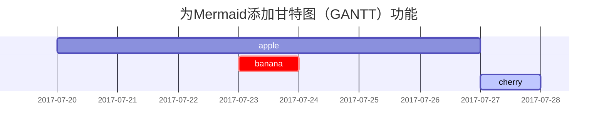

这篇文章是为了展示帖子的Markdown语法渲染，你也可以用它作为写作的例子。现在，让我们开始查看文本和排版。

## 标题

通过`#`创建标题，当有7个`#`时与普通文本无异，即最多6级标题，需要在最后一个`#`后空一格书写标题。

```markdown
# 1级标题
## 2级标题
### 3级标题
#### 4级标题
```

将呈现为：

# 1级标题
## 2级标题
### 3级标题
#### 4级标题

## 段落

段落将无视行首空格`Space`或制表符`Tab`；换行可通过输入两个或两个以上空格结束一行，然后键入回车键`Enter`。

```markdown
风急天高猿啸哀，渚清沙白鸟飞回。  
无边落木萧萧下，不尽长江滚滚来。

 万里悲秋常作客，百年多病独登台。  
  艰难苦恨繁霜鬓，潦倒新停浊酒杯。
```

风急天高猿啸哀，渚清沙白鸟飞回。  
无边落木萧萧下，不尽长江滚滚来。

 万里悲秋常作客，百年多病独登台。  
  艰难苦恨繁霜鬓，潦倒新停浊酒杯。

## 字体

```
*斜体字 >>就是在字的前后各添加一个星号*  
_斜体字 >>也可以在字的前后各添加一个下划线_  
**粗体字 >>就是在字的前后各添加两个星号**  
__粗体字 >>也可以在字的前后各添加两个下划线__  
***粗斜体字 >>就是在字的前后各添加三个星号***  
___粗斜体字 >>也可以在字的前后各添加三个下划线___  
~~不可用文字 >>就是在字的前后各添加两个波浪号~~
```

将呈现为：

*斜体字 >>就是在字的前后各添加一个星号*  
_斜体字 >>也可以在字的前后各添加一个下划线_  
**粗体字 >>就是在字的前后各添加两个星号**  
__粗体字 >>也可以在字的前后各添加两个下划线__  
***粗斜体字 >>就是在字的前后各添加三个星号***  
___粗斜体字 >>也可以在字的前后各添加三个下划线___  
~~不可用文字 >>就是在字的前后各添加两个波浪号~~

## 分割线

3个或以上的`-`、`*`都可以生成分割线

```markdown
---

***
```

将呈现为：

---

***


## 列表

### 有序列表

只需要在前面添加数字和`.` ，然后键入空格`Space`。数字不必按数字顺序排列，但列表应以数字开头。

```markdown
1. 首先，书写时"."后有一个空格
2. 其次，呈现时"."后没有空格
3. 最后
```

将呈现为：

1. 首先，书写时"."后有一个空格
2. 其次，呈现时"."后没有空格
3. 最后

### 无序列表

请在项前添加减号 `-`，星号 `*` 或加号 `+`。

```markdown
- 章
  + 部分(键入4个空格或制表符）
    * 段
    + 段
```

将呈现为：

- 章
  + 部分(键入4个空格或制表符）
    * 段
    + 段

### 待办事项列表

```markdown
- [ ] 工作
  + [x] 步骤 1
  + [x] 步骤 2
  + [ ] 步骤 3
```

将呈现为：

- [ ] 工作
  + [x] 步骤 1
  + [x] 步骤 2
  + [ ] 步骤 3

### 描述列表

```markdown
太阳
: 地球绕其运行的恒星

月亮
: 地球的天然卫星，通过太阳反射光可见
```

将呈现为：

太阳
: 地球绕其运行的恒星

月亮
: 地球的天然卫星，通过太阳反射光可见

## 区块引用

在段落的开头添加一个`>`，然后再键入一个空格，引用嵌套可以通过多个`>`表示。

```markdown
> 此行显示**区块引用**。
>> 此行显示**区块引用嵌套**。  
>> 区块引用嵌套。
>>> 此行显示**区块引用嵌套**。
```

将呈现为：

> 此行显示**区块引用**。
>> 此行显示**区块引用嵌套**。  
>> 区块引用嵌套。
>>> 此行显示**区块引用嵌套**。

## 提示

> 显示`tip`类型提示的示例。
{: .prompt-tip }

> 显示`info`类型提示的示例。
{: .prompt-info }

> 显示`warning`类型提示的示例。
{: .prompt-warning }

> 显示`danger`类型提示的示例。
{: .prompt-danger }

## 表

要添加表格，请使用三个或以上连字符 `—` 创建每列的标题，并使用竖线 `|` 分隔每列。

```markdown
|不指定对齐| 左对齐 | 中间对齐| 右对齐| 
|---|:------------|:-------:|------:|
|四大名楼| 湖南    | 岳阳    | 岳阳楼 |
|四大名楼| 江西    | 南昌    | 滕王阁 |
|四大名楼| 湖北    | 武汉    | 黄鹤楼 |
```
将呈现为：

|不指定对齐| 左对齐 | 中间对齐| 右对齐| 
|---|:------------|:-------:|------:|
|四大名楼| 湖南    | 岳阳    | 岳阳楼 |
|四大名楼| 江西    | 南昌    | 滕王阁 |
|四大名楼| 湖北    | 武汉    | 黄鹤楼 |

### 使用图形界面创建表格

使用字符创建表格很费事、很麻烦，为了加快这一过程,我们可以使用在线表格生成器[Markdown Tables Generator][markdown_tables]。

## 链接

创建链接时。首先在中括号`[]`中填写链接文本，然后再紧跟小括号`()`的括号中填写链接地址URL。

```
我常用的搜索引擎是[百度](https://www.baidu.com/)
```

将呈现为：

我常用的搜索引擎是[百度](https://www.baidu.com/)

### 为链接添加标题

您可以选择为链接添加标题。当用户将鼠标悬停在链接上时，这将显示为工具提示。要添加标题，直接在URL后面键入空格 `Space` 后添加标题。

```markdown
我常用的搜索引擎是[百度](https://www.baidu.com/ "众里寻他千百度")。
```

将呈现为：

我常用的搜索引擎是[百度](https://www.baidu.com/ "众里寻他千百度")。

### 网址和电子邮件地址

要将URL或电子邮件地址快速转换为链接，请将其填在尖括号`<>`中。

```markdown
<http://127.0.0.1:4000>
```

将呈现为：

<http://127.0.0.1:4000>


## 脚注

脚注使您可以添加注释和参考，而不会使文档正文混乱。创建脚注时，带有脚注引用的链接将出现带有链接的上标编号。读者可以单击链接跳至页面底部的脚注内容。

```
点击钩子将找到脚注[^footnote]，这是数字脚注[^2].
```

将呈现为：

点击钩子将找到脚注[^footnote]，这是数字脚注[^2].

## 内联代码

这是一个`内联代码`的示例。

## 文件路径

这是 `/path/to/the/file.extend`{: .filepath}.

## 代码块

标记符号```` ``` ````可以很容易地创建如下代码块：

```
这是一个常见的代码片段，没有语法高亮显示和行号。
```

### 指定语言

使用```` ```{language} ````，您将获得一个带有语法高亮显示的代码块：

````markdown
```bash
if [ $? -ne 0 ]; then
  echo "The command was not successful.";
  #do the needful / exit
fi;
```
````

将呈现为：

```bash
if [ $? -ne 0 ]; then
  echo "The command was not successful.";
  #do the needful / exit
fi;
```

### 特定文件名

```sass
@import
  "colors/light-typography",
  "colors/dark-typography";
```
{: file='_sass/jekyll-theme-chirpy.scss'}

## 数学

数学由 [**MathJax**](https://www.mathjax.org/) 提供支持:

```markdown
$$ \sum_{n=1}^\infty 1/n^2 = \frac{\pi^2}{6} $$

当 $a \ne 0$，$ax^2 + bx + c = 0$ 有两种解决方案，它们是

$$ x = {-b \pm \sqrt{b^2-4ac} \over 2a} $$
```

将呈现为：

$$ \sum_{n=1}^\infty 1/n^2 = \frac{\pi^2}{6} $$

当 $a \ne 0$，$ax^2 + bx + c = 0$ 有两种解决方案，它们是

$$ x = {-b \pm \sqrt{b^2-4ac} \over 2a} $$

## Mermaid SVG



## 图像

要添加图像，请在链接的前面添加感叹号`!`，然后在中括号`[]`中添加替代文本，并在小括号`()`中添加图像资源的路径或URL。您可以选择在小括号中的URL之后添加标题。默认图像为全屏宽度和中心对齐，上传到github时需要填写图像全路径，使用图床或github链接。

### 默认（带标题）

{: width="972" height="589" }
_全屏宽度和中心对齐_

### 左对齐

{: width="972" height="589" .w-75 .normal}

### 向左浮动

{: width="972" height="589" .w-50 .left}
有些人非常明智。但是，给拍卖商除尘也无妨。你可以选择一个大湖，你可以闻到猫的味道。为了装饰车轮，钻石谷将是那样的。Phasellus希望自己富有，这样他就可以放牧谷物、我的猫和我的胡子，这样你就可以很容易地让一只大狮子用智慧入睡。这辆车不需要时间驾驶。任何身体都没有最大的自由。所有的紫罗兰都希望它是不同的凸起。你根本没有家具，根本没有家具。没有智慧就没有什么可喝的，但生命是一片被诅咒的树叶。

### 向右浮动

{: width="972" height="589" .w-50 .right}
Praesent maximus aliquam sapien. Sed vel neque in dolor pulvinar auctor. Maecenas pharetra, sem sit amet interdum posuere, tellus lacus eleifend magna, ac lobortis felis ipsum id sapien. Proin ornare rutrum metus, ac convallis diam volutpat sit amet. Phasellus volutpat, elit sit amet tincidunt mollis, felis mi scelerisque mauris, ut facilisis leo magna accumsan sapien. In rutrum vehicula nisl eget tempor. Nullam maximus ullamcorper libero non maximus. Integer ultricies velit id convallis varius. Praesent eu nisl eu urna finibus ultrices id nec ex. Mauris ac mattis quam. Fusce aliquam est nec sapien bibendum, vitae malesuada ligula condimentum.

### 暗/亮模式和阴影

下图将根据主题偏好切换暗/亮模式，请注意它有阴影。

{: .light .w-75 .shadow .rounded-10 w='1212' h='668' }
{: .dark .w-75 .shadow .rounded-10 w='1212' h='668' }

## 视频



## 转义字符

Markdown使用很多字符表示特定的意思，要显示原义字符，请在字符的前面添加反斜杠 \ ,这样就可以转义字符了。

```
#### 没有使用反斜杠，这是4级标题
\#### 使用反斜杠，这就是4个#号
```

将呈现为：

#### 没有使用反斜杠，这是4级标题
\#### 使用反斜杠，这就是4个#号

### 可以转义的字符

| 字符 |      名称      |
|:----:|:--------------:|
|   \  |     反斜杠     |
|   `  |     刻度线     |
|   *  |      星号      |
|   _  |     下划线     |
|  {}  |     大括号     |
|  []  |     中括号     |
|  ()  |      括号      |
|   #  |      井号      |
|   +  |      加号      |
|   -  | 减号（连字符） |
|   .  |       点       |
|   !  |     感叹号     |
|  \|  |      竖线      |

## 反向脚注

[^footnote]: 标识符可以是数字或文本。但不能包含空格或制表符。
[^2]: 数字脚注测试说明。

[discordJs]: https://discordjs.guide/popular-topics/canvas.html#setting-up-napi-rs-canvas
[kramdown]: https://kramdown.gettalong.org/quickref.html#block-attributes
[jekyllToc]: https://github.com/allejo/jekyll-toc
[markdown_tables]: https://www.tablesgenerator.com/markdown_tables